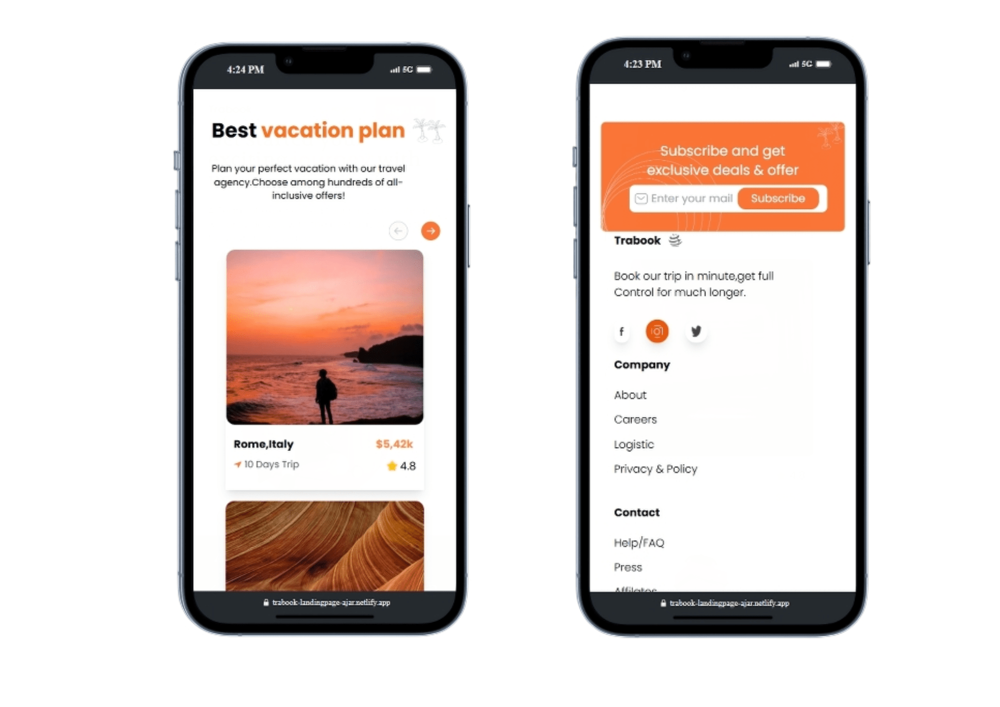

# HTML/Tailwind CSS Landing Page

A fully responsive landing page built using **HTML** and **Tailwind CSS**. The design is implemented as per the provided **Figma** file, ensuring pixel-perfect accuracy and adaptability across all devices.

## 🚀 Live Demo
[View Demo](https://trabook-landingpage-ajar.netlify.app/) <!-- Replace with actual demo URL -->

## 🛠 Tech Stack
- **HTML**
- **TailwindCSS**

## 📂 Project Structure
- `index.html` – Main HTML file
- `styles/` – Contains Tailwind CSS configuration
- `assets/` – Stores images and icons
- `scripts/` – JavaScript files (if any)

## 🎨 Features

### ✅ Pixel-Perfect Design
- Follows the provided **Figma** design accurately.
- Maintains a clean and modern layout.

### 📱 Fully Responsive
- Optimized for **desktops, tablets, and mobile devices**.
- Uses **Tailwind's responsive utilities**.

### ⚡ Fast & Lightweight
- Built with **pure HTML and Tailwind CSS** for performance.
- Ensures **smooth and fast loading**.

### 🔧 Scalable & Maintainable
- Uses **Tailwind's utility-first approach**.
- Easy to **modify and extend**.

### 🎨 Figma Reference
- The design is based on the given **Figma file**.
- Ensures consistency with **modern UI trends**.

## 📸 Screenshots
| Landing Page Preview |
|----------------------|
|  |
|  |
|  |
|  |
|  |
|  |

